# Introduction


## Minikube Configuration  
Allocate the following resources for Minikube:  
- **CPUs**: 6  
- **RAM**: 12 GB  

### Ray Cluster Resource Requirements  
My Ray cluster configure as follows:  
- **1 Ray Head Node**:  
  - **CPUs**: 2  
  - **RAM**: 3 GB  
- **3 Ray Worker Nodes**:  
  - **CPUs**: 1 per node  
  - **RAM**: 2 GB per node  

Adjust the allocation during Minikube setup:  
```bash
minikube start --cpus=6 --memory=12g
```


# Setup  
## System Structure  
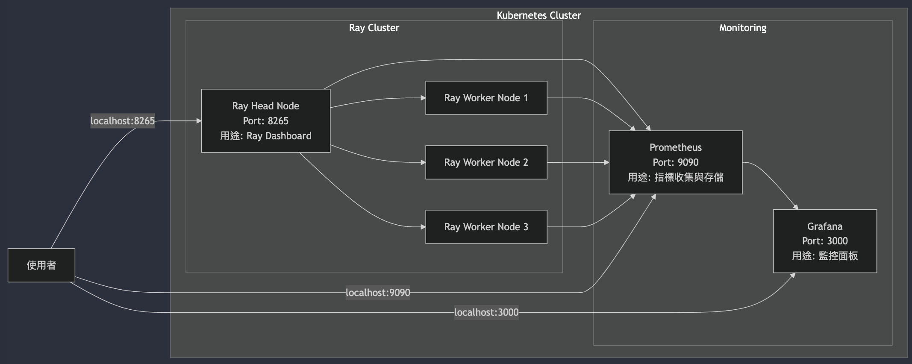

## Steps to Set Up and Run KubeRay  

1. **Create a `Makefile`**  
   Copy the contents from `Makefile.example` into a new `Makefile` and add the required environment variable:  
   ```make
   IMAGE_NAME=
   ```

2. **Build and Push Docker Image**  
   Build the Docker image locally and push it to Docker Hub by running:  
   ```bash
   make build
   ```

4. **Install KubeRay Operator**  
   Use Helm to deploy the KubeRay operator:  
   ```bash
   helm install kuberay-operator kuberay/kuberay-operator --version 1.2.2
   ```

5. **Deploy Ray Cluster Using YAML**  
   Deploy the Ray Cluster with a predefined YAML configuration:  
   ```bash
   make deploy
   ```

6. **Install Prometheus and Grafana**  
   Set up Prometheus and Grafana for monitoring:  
   ```bash
   kubectl create namespace prometheus

   helm install prometheus prometheus-community/prometheus \
       --namespace prometheus \
       --set alertmanager.persistentVolume.enabled=false \
       --set server.persistentVolume.enabled=false

   helm install grafana grafana/grafana --version 6.52.3 \
       --namespace prometheus \
       --set persistence.enabled=false \
       --set adminPassword='admin' \
       --set service.type=LoadBalancer
   ```

7. **Apply Service Configuration**  
   Configure Ray services:  
   ```bash
   kubectl apply -f ./k8s/ray-service.yaml
   ```

8. **Update Grafana Configuration**  
   Update Grafana settings and restart its deployment:  
   ```bash
   kubectl apply -f ./k8s/grafana-config.yaml -n prometheus
   kubectl rollout restart deployment -n prometheus grafana
   ```

9. **Check RayCluster Status**  
   Verify the status of the RayCluster:  
   ```bash
   make check-status
   ```
   Example output:  
   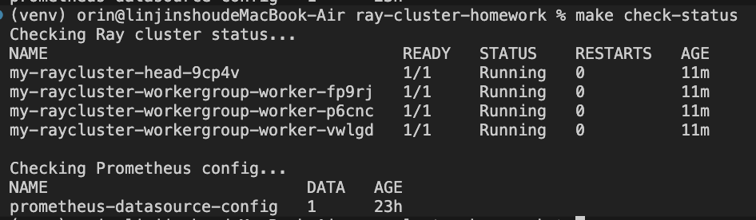

10. **Check Pod Status**  
    View the current status of all pods:  
    ```bash
    kubectl get pods -n default
    ```

11. **Check Service Status**  
    Confirm the status of services:  
    ```bash
    kubectl get services -n default
    ```

12. **Access the Head Node**  
    Enter the RayCluster head node:  
    ```bash
    make exec-head
    ```

13. **Set Up Port Forwarding**  
    - Forward the Ray Dashboard port (8265) to your local machine:  
      ```bash
      make proxy
      ```
      Access the Ray Dashboard at `http://localhost:8265`.

    - Forward ports for Prometheus and Grafana:  
      ```bash
      make clean-monitoring
      make setup-monitoring
      ```
      Access Grafana at `http://localhost:3000` and Prometheus at `http://localhost:9090`.

14. **Upload dashborad to Grafana**
    You can use script to upload dashborad
    ```bash
      upload-dashboard.sh
      ```
    or manual import
    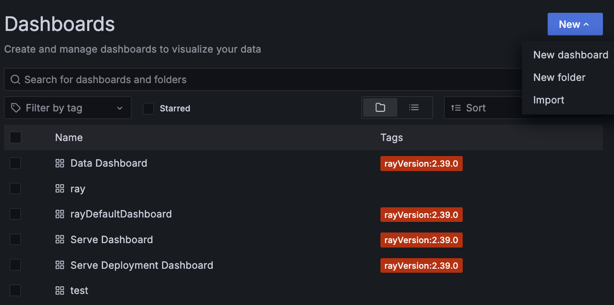

15. **Final**
    1. Ray dashborad
        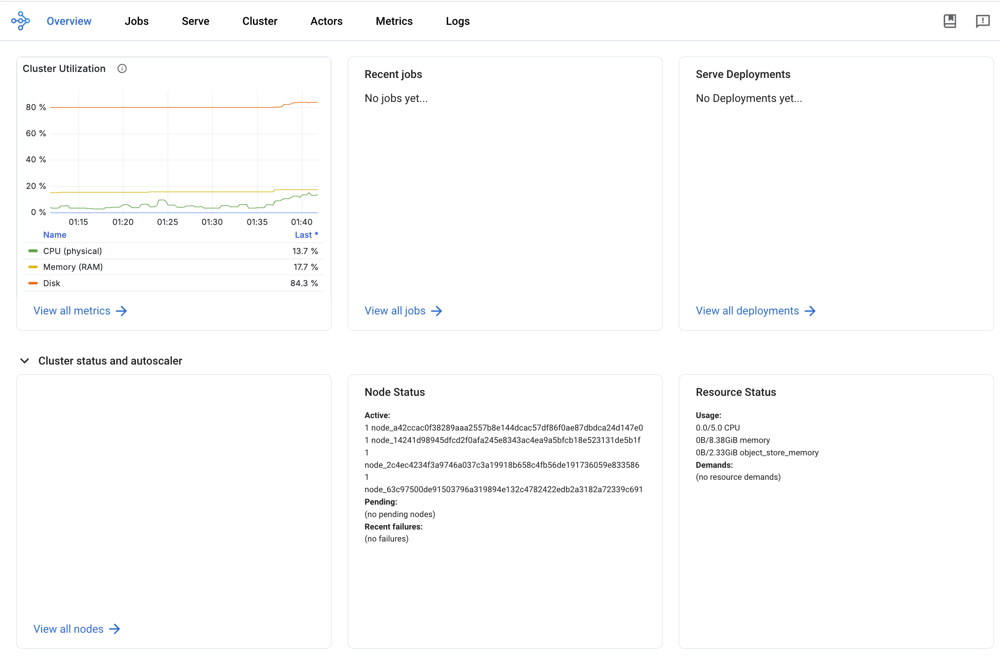
    2. System metrice on dashborad
        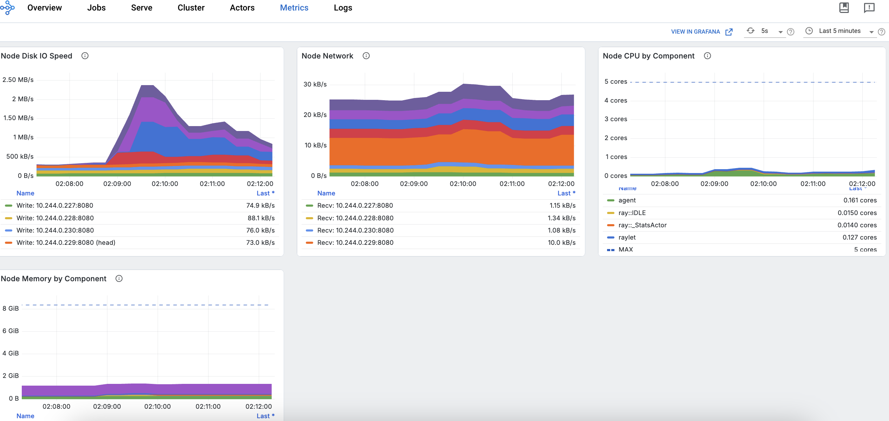
    3. Grafana
        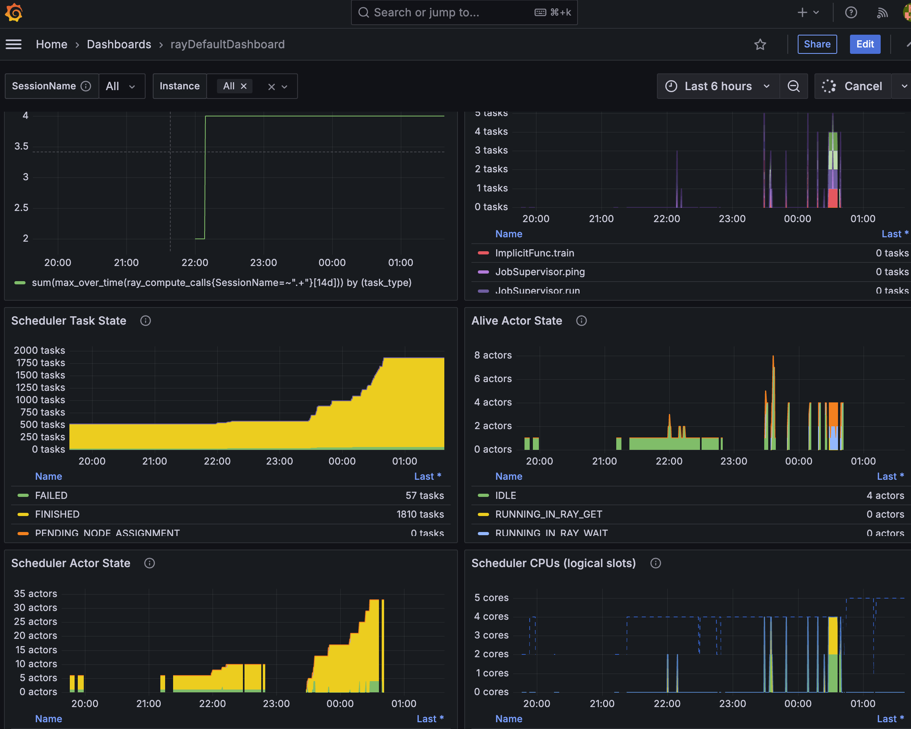


--- 


# Question 1
```bash
ray job submit --address http://localhost:8265 -- python3 ./scripts/parallel_compute.py
```
Result
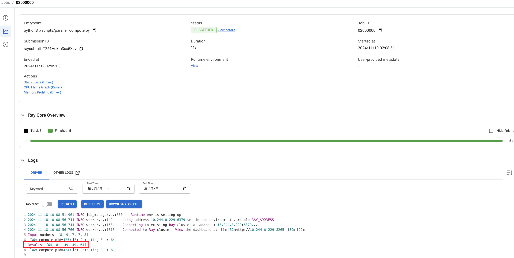
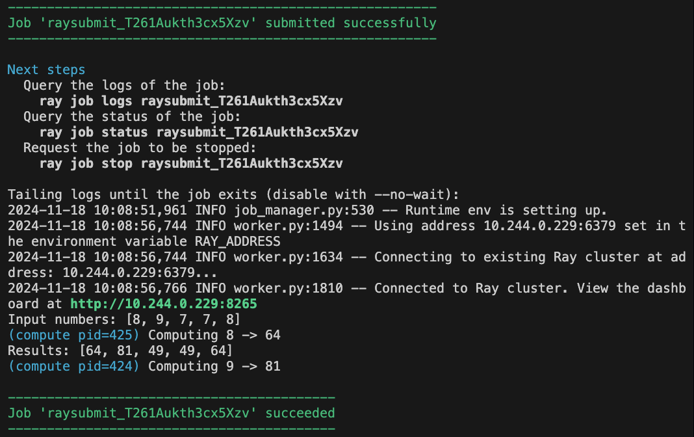

# Question 2
```bash
ray job submit --address http://localhost:8265 -- python3 ./scripts/unstable_task.py
```
Result
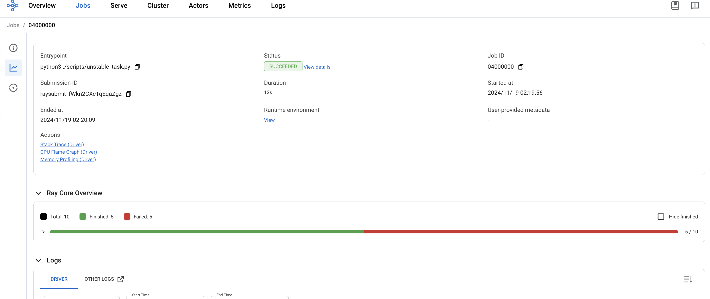
Can find error log in terminal if submit job without `--no-wait`
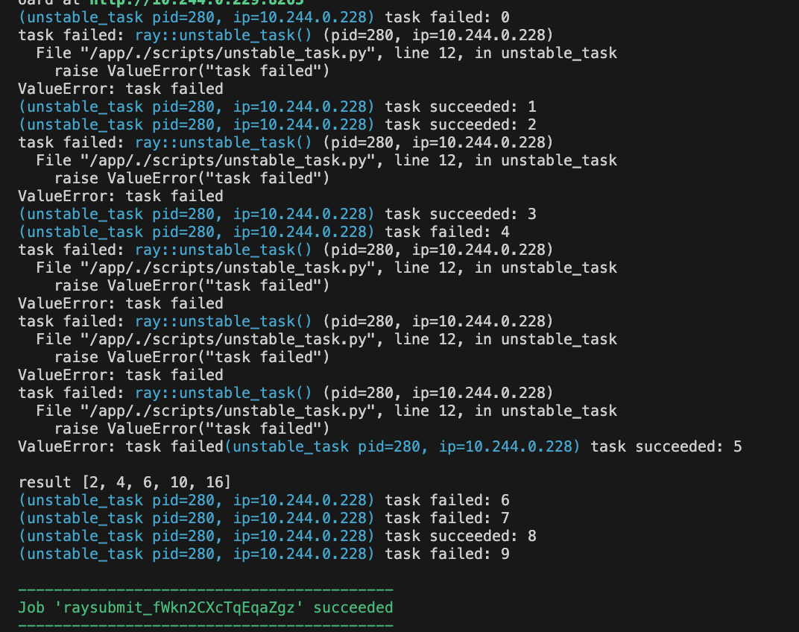


# Question 3

I use `Ray Train`, `Ray Tune`, and `YOLOv8` to implement a training process, utilizing the `COCO128` dataset.

```bash
ray job submit --address http://localhost:8265 -- python3 ./scripts/training.py
```
Note: Due to my limited computer resources, I have configured only one worker with 2 CPUs and 6GB of RAM to prevent out-of-memory (OOM) errors. I am also using a single set of hyperparameters to establish the workflow.
```python
     search_space = {
         "batch_size": tune.choice([4]),
         "lr0": tune.choice([0.001]),
         "imgsz": tune.choice([64]),
         "epochs": tune.choice([1]),
     }
```

## 1. **Dataset Preparation**
   - **Annotation Format**: Ensure the dataset is annotated in a supported format such as COCO or Pascal VOC. For YOLO, the common format involves `.txt` files where each line corresponds to an object, formatted as:  
     ```
     <class_id> <x_center> <y_center> <width> <height>
     ```
     All values are normalized (0 to 1).
   - **Split the Dataset**: Divide the dataset into training, validation, and testing sets (e.g., 70%-20%-10% split).
   - **Directory Structure**:
     ```
     dataset/
     └── coco128
            │
            └──images
            │     └─ train2017
            └── labels
                  └─ train2017

     ```
   - **Data YAML File**: YAML configuration file (`coco128.yaml`) specifying the paths to the images and labels and the class names

## 2. **Training Process**
   - **Pre-Trained Model**: Load a pre-trained YOLO model `YOLOv8n`.
   - **Training Setup**:  `train_loop_per_worker` function initializes the training:
     ```python
     model = YOLO("yolov8n.pt")
     results = model.train(
         data="./datasets/coco128.yaml",
         epochs=config["epochs"],
         imgsz=config["imgsz"],
         batch=config["batch_size"],
         lr0=config["lr0"],
         device=device,
         plots=False,
         save=False,
     )
     ```
     The results are logged, including `mAP50` scores for tracking performance.

   - **Validation**: After each epoch, the model is validated on the validation set using:
     ```python
     val_results = model.val(
         data="./datasets/coco128.yaml",
         batch=config["batch_size"],
         imgsz=config["imgsz"],
         device=device,
         plots=False,
         save=False,
     )
     ```

   - **Reporting**: During the training loop, metrics such as `mAP50`, batch size, learning rate, and image size are logged and reported for tracking and optimization.

## 3. **Hyperparameter Optimization**
   - **Search Space**: The script utilizes `ray.tune` for hyperparameter tuning. The search space is defined as:
     ```python
     search_space = {
         "batch_size": tune.choice([4, 8, 16]),
         "lr0": tune.choice([0.001, 0.005, 0.01]),
         "imgsz": tune.choice([64, 128, 256]),
         "epochs": tune.choice([1, 3, 5]),
     }
     ```
   - **Objective Function**: The goal is to maximize the `mAP50` metric.
   - **Distributed Training**: The `TorchTrainer` from `ray.train` manages distributed training, leveraging resources efficiently:
     ```python
     trainer = TorchTrainer(
         train_loop_per_worker=train_loop_per_worker,
         scaling_config=ScalingConfig(num_workers=1, use_gpu=False),
         train_loop_config=config,
     )
     ```

   - **Best Hyperparameters**: After tuning, the best configuration is retrieved:
     ```python
     best_result = results.get_best_result()
     logger.info(f"Best result: {best_result}")
     ```

## 4. **Hyperparameter Adjustment for Better Performance**
   - **Learning Rate (`lr0`)**: Adjust the initial learning rate based on loss trends. A lower learning rate can stabilize training if the loss oscillates.
   - **Batch Size**: Increase the batch size if GPU memory allows, which may lead to more stable gradients and faster convergence.
   - **Image Size (`imgsz`)**: Use larger image sizes for better accuracy but ensure compatibility with hardware constraints.
   - **Number of Epochs**: Increase epochs for more thorough training if underfitting is observed.

## 5. **Evaluation (TBD)**
   - Validate the model on the test dataset and evaluate key metrics (`mAP50`, precision, recall).
   - (TBD) Save the trained model for deployment or further fine-tuning.

# Quesiton 4

### 1. **Configuring for Monitoring**
I noticed that only system metrics are visible on the Ray dashboard. Instead, I set custom metrics in the training function and used Grafana to visualize them.

1. **Enable Metrics Reporting**: Use Ray's built-in counters and gauges to log relevant metrics during training. For example:
   ```python
   from ray.util.metrics import Counter, Gauge

   training_iterations = Counter("training_iterations", description="Number of training iterations completed")
   current_map50 = Gauge("map50_score", description="Current mAP50 score")
   ```

2. **Update Metrics in the Training Loop**:
   - Log training progress:
     ```python
     training_iterations.inc()
     ```
   - Report key metrics like mAP50:
     ```python
     current_map50.set(float(best_map))
     ```

3. **Integrate with Ray's Reporting System**: Use `ray.tune.report()` 
   ```python
        report(
            {
                "epoch": epoch + 1,
                "mAP50": float(best_map),
                "batch_size": config["batch_size"],
                "lr0": config["lr0"],
                "imgsz": config["imgsz"],
            }
                    )
   ```

### 2. **Interpreting Loss and Accuracy Trends**
- **Convergence Analysis**:
  - A steadily decreasing training loss and a plateauing validation loss indicate convergence.
  - Use the `mAP50` metric as a measure of model performance on the validation dataset. A consistently increasing `mAP50` implies the model is learning effectively.

- **Overfitting Detection**:
  - If the validation loss starts increasing while the training loss continues to decrease, the model is overfitting.
  - (TBD) Look for a divergence between training and validation metrics (e.g., `mAP50` or precision/recall scores).

---

### 3. **Optimizing the Model Based on Monitoring**
- **Adjust Learning Rate**:
  - If the loss oscillates or fails to decrease, the learning rate may be too high. Decrease the learning rate to stabilize training.
  - If the loss decreases too slowly, try increasing the learning rate for faster convergence.

- **Regularization**:
  - If overfitting is detected, introduce regularization techniques:
    - **Dropout layers**: Add dropout to the model architecture.
    - **Data augmentation**: Enhance the dataset with transformations to increase variety.

- **Batch Size Adjustment**:
  - Larger batch sizes lead to smoother gradients and faster convergence but require more memory. Use the largest batch size that hardware can accommodate.

- **Early Stopping**:
  - Implement early stopping to halt training when the validation loss stops improving, avoiding unnecessary computation and overfitting.
  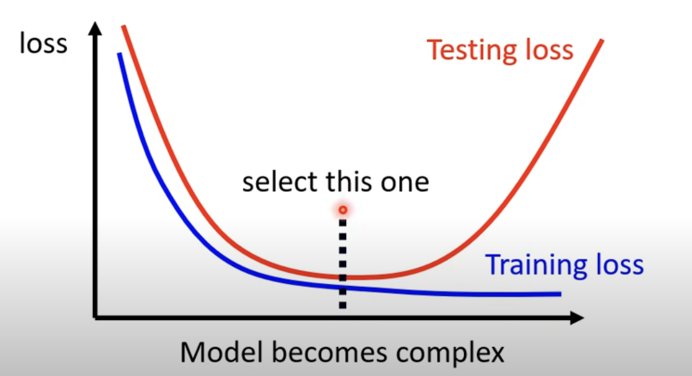
  (resoruce:https://www.youtube.com/watch?v=WeHM2xpYQpw&ab_channel=Hung-yiLee)


# Project File Structure

├── CHANGELOG.md                                
├── Dockerfile                                  
├── Makefile.example                            # Example template for creating Makefile
├── dashboards/                                 # Grafana dashboard configurations
│   ├── data_grafana_dashboard.json            
│   ├── default_grafana_dashboard.json         
│   ├── serve_deployment_grafana_dashboard.json  
│   └── serve_grafana_dashboard.json           
├── entrypoint.sh                               # Container entry point script
├── images/                                     # Directory for documentation images
├── init/                                       # Initialization scripts
│   └── download_dataset.py                     
├── k8s/                                        # Kubernetes configuration files
│   ├── grafana-config.yaml                     # Grafana settings
│   ├── prometheus-config.yaml                  # Prometheus settings
│   ├── ray-cluster.yaml                        # Ray cluster configuration
│   └── ray-service.yaml                        # Ray service definitions
├── readme.md                                   # Project documentation
├── requirements.txt                            # Python package dependencies
├── scripts/                                    
│   ├── parallel_compute.py                     # Script for parallel computation tasks
│   ├── training.py                             # ML model training script
│   └── unstable_task.py                        # Script for testing system stability
├── upload-dashboard.sh                         # Script to upload dashboards to Grafana

### Future Work

[] Keep trying integrate Custom Metrics into Ray Dashboard.
[] Enable training results to be sent to an external system for further analysis or storage.
[] Configure persistent volume storage to prevent data loss in case of server crashes.